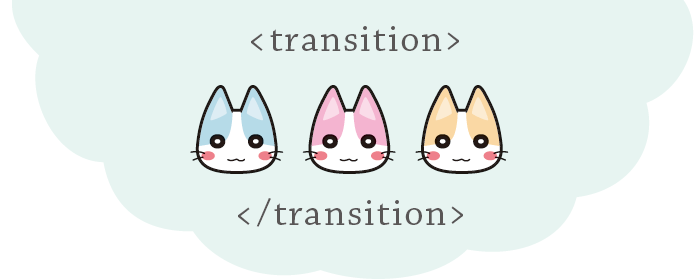

# 个人博客

站在人文与科技的十字路口。

🐾

<a href="https://redeememer.com/">https://redeememer.com/</a>

## 格言

心胸是我在生活中想要达到的最低目标，某件事有悖于我的心胸，我就认为不值得做，某个人有悖于我的心胸，我就觉得他不值得一交，某种生活有悖于我的心胸，我就会以为它不值得一过。

罗素先生曾言，对人来说，不加检点的生活，确实不值得一过，我同意他的意见，不加检点的生活，属于不能接受的生活一种，人必须过他可以接受的生活，这恰恰是他改变一切的动力，人有了心胸，就可以用它来改变自己的生活。
